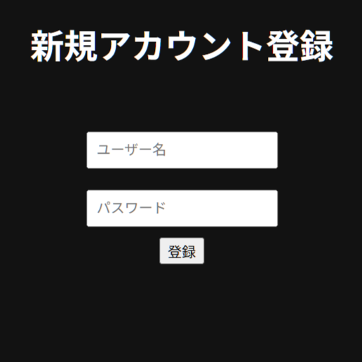
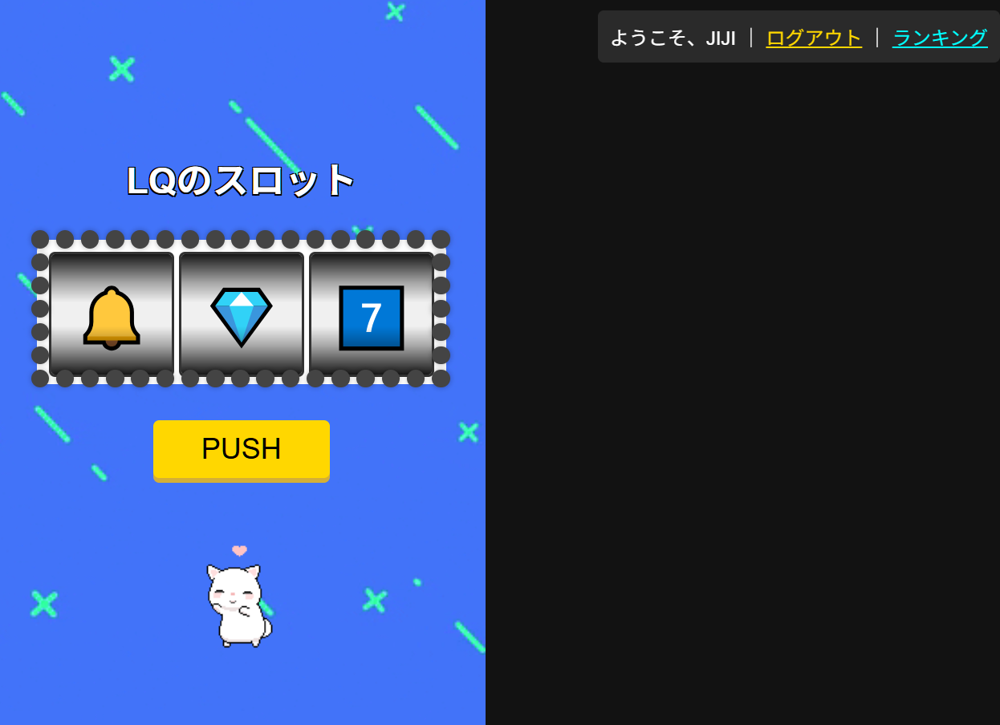
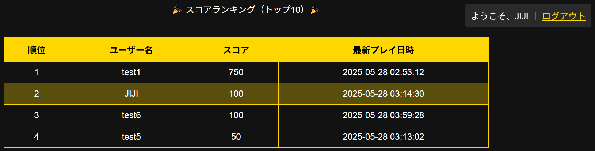
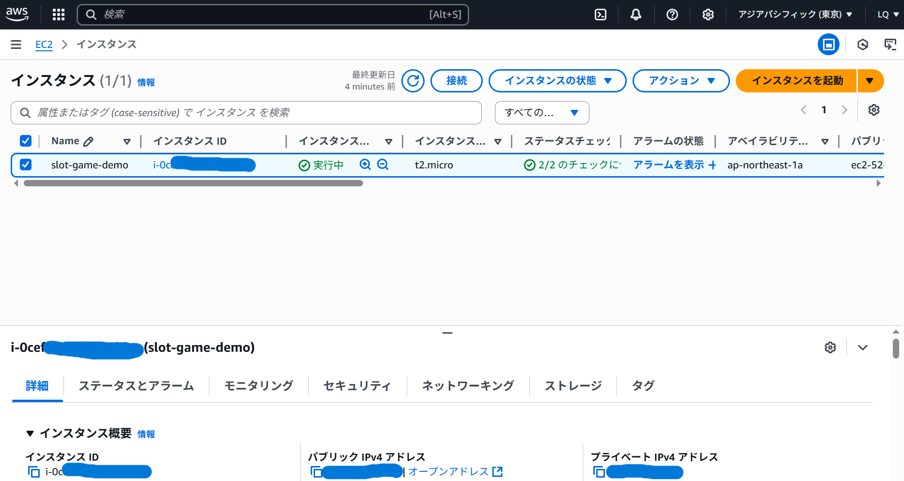

## Slot Game - PHP × AWS 実装版

LAMP 環境（Linux, Apache, MySQL, PHP）上に構築されたシンプルなスロットゲームです。  
ユーザー登録、ログイン、スコア保存、ランキング表示などの基本機能を備えています。
フロントエンドからバックエンド、音声素材まで全て一人で開発しました。
HTML・CSS・JavaScript・PHP・MySQL・AWS を学ぶ目的で開発されたポートフォリオです。
実際に EC2 へデプロイすることで AWS の基本知識も習得しました。

---
| カテゴリ       | 使用技術                              |
|----------------|--------------------------------------------|
| 言語・環境     | PHP / JavaScript / HTML / CSS             |
| データベース   | MySQL（RDB）                              |
| Webサーバー    | Apache（Ubuntu）                          |
| デプロイ先     | AWS EC2（Linux）                          |
| その他ツール   | Git / WinSCP / SSH / Visual Studio Code 等 |

---

## 主な機能

- ユーザー登録・ログイン・ログアウト
- SHA2 パスワード暗号化
- スコア自動保存
- 累計得点ランキング
- UI・アニメ・サウンド演出付きスロットゲーム
- 日本語対応

---

## スクリーンショット

#### ログイン

#### 新規登録

#### ゲーム

#### ランキング

#### AWS稼働状況

---

🏁 今後のアップデート予定
管理者モードの実装（不正スコアの削除、BAN機能など）

スコアリセット機能の追加

BGM・効果音の ON/OFF 設定

ダークテーマ切り替え

モバイル表示最適化
