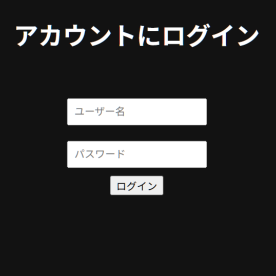

## Slot Game - PHP × AWS 実装版

これは、LAMP 環境（Linux, Apache, MySQL, PHP）上に構築されたシンプルなスロットゲームです。  
ユーザー登録、ログイン、スコア保存、ランキング表示などの基本機能を備えています。

---
| カテゴリ       | 使用技術                              |
|----------------|--------------------------------------------|
| 言語・環境     | PHP / JavaScript / HTML / CSS             |
| データベース   | MySQL（RDB）                              |
| Webサーバー    | Apache（Ubuntu）                          |
| デプロイ先     | AWS EC2（Linux）                          |
| その他ツール   | Git / WinSCP / SSH / Visual Studio Code 等 |

---

## 主な機能

- ユーザー登録・ログイン・ログアウト機能（セッション管理あり）
- SHA2 パスワード暗号化（安全性考慮）
- スコアの自動保存（AJAX 経由）
- 累計得点によるランキング機能（最新プレイ日時付き）
- UI・アニメ・サウンド演出付きのスロットゲーム
- 日本語インターフェース対応

---

## スクリーンショット

- ログイン画面
  
- スロットプレイ画面
- 一等当選の演出
- ランキング画面
- AWS EC2 上の動作画面（IPマスキング済）

---

## 💻 ローカル環境での起動（開発用）

```bash
git clone https://github.com/lq0502/slot-game-aws-php.git
cd slot-game-aws-php
php -S localhost:8000
アクセス: http://localhost:8000/login.php

☁️ AWS EC2 へのデプロイ（簡易手順）
EC2（Ubuntu）インスタンス作成

セキュリティグループで HTTP（80 番）を許可

以下のパッケージをインストール：

bash
コピーする
編集する
sudo apt update
sudo apt install apache2 php php-mysql mysql-server unzip
このプロジェクトを /var/www/html/slot-game に配置（WinSCP or SCP 推奨）

db.php の DB 接続設定を EC2 上の MySQL に合わせて編集

MySQL にて以下を実行：

sql
コピーする
編集する
CREATE DATABASE slot_game;
USE slot_game;

CREATE TABLE users (
    id INT AUTO_INCREMENT PRIMARY KEY,
    username VARCHAR(50) UNIQUE NOT NULL,
    password VARCHAR(255) NOT NULL
);

CREATE TABLE scores (
    id INT AUTO_INCREMENT PRIMARY KEY,
    user_id INT NOT NULL,
    score INT NOT NULL,
    created_at TIMESTAMP DEFAULT CURRENT_TIMESTAMP,
    FOREIGN KEY (user_id) REFERENCES users(id)
);
ブラウザでアクセス：
http://[EC2のパブリックIP]/slot-game/login.php

📂 ディレクトリ構成
text
コピーする
編集する
slot-game-aws-php/
├── index.php           // ゲーム本体
├── login.php           // ログイン画面
├── register.php        // アカウント登録
├── logout.php          // ログアウト処理
├── ranking.php         // ランキング表示
├── save_score.php      // スコア保存（AJAX 経由）
├── db.php              // DB 接続設定
├── 音声・画像ファイル // cat.gif / bg.gif / mp3 等
✍️ 作者について
フロントエンドからバックエンド、音声素材まで全て一人で開発

PHP / Java / MySQL を学ぶためのポートフォリオ制作プロジェクト

実際に EC2 へデプロイすることで AWS の基本知識も習得

📫 連絡先
開発者：LQ
GitHub：@lq0502

🏁 今後のアップデート予定
管理者モードの実装（不正スコアの削除、BAN機能など）

スコアリセット機能の追加

BGM・効果音の ON/OFF 設定

ダークテーマ切り替え（アクセシビリティ向上）

モバイル表示最適化（レスポンシブ対応）
